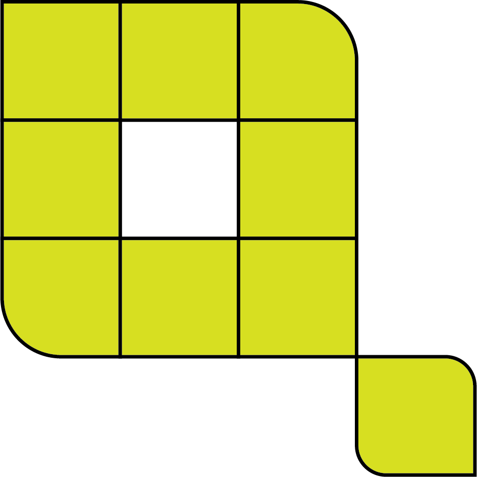

# Quant



This repository is a PyTorch implementation of [Least Squares Binary Quantization of Neural Networks](http://openaccess.thecvf.com/content_CVPRW_2020/papers/w40/Pouransari_Least_Squares_Binary_Quantization_of_Neural_Networks_CVPRW_2020_paper.pdf) and can be used to reproduce the results in the paper.

**The code is written to use Python 3.6 or above.**

## Installation

To install Quant you first need to clone our repository.

We suggest you first create a virtual environment and install dependencies in the virtual environment.

```bash
# Go to repo
cd <path/to/quant>
# Create virtual environment ...
python -m venv .venv
# ... and activate it
source .venv/bin/activate
# Upgrade to the latest versions of pip and wheel
pip install -U pip wheel
pip install -r requirements.txt
```

Then install quant with these commands:

```bash
pip install flit
flit install -s
```

## Quick Start

To run MNIST training on the local machine, do this:

```bash
python examples/mnist/mnist.py --config examples/mnist/mnist_fp.yaml --experiment-name mnist-fp
```

One can also resume an existing experiment.
For example, here we restore an experiment trained locally on local.
The `--restore-experiment` argument points to the path of a previous experiment,
and `--skip-training` means for the resumed job we would like to only perform evaluation (i.e., no training).

```bash
python examples/mnist/mnist.py --restore-experiment experiments/mnist-fp --skip-training
```

For CIFAR-100 and ImageNet, the CLI interface is the same.
Simply use the configs in the `examples/{mnist,cifar100,imagenet}/` directories.

[mnist_fp.yaml](./examples/mnist/mnist_fp.yaml), [cifar100_fp.yaml](./examples/cifar100/cifar100_fp.yaml) and [imagenet_fp.yaml](./examples/imagenet/imagenet_fp.yaml)
include comments that list configuration choices for some important parameters with references to documentation sections that explain them in more detail.

All experiments store the configurations used, overall metrics, checkpoints, and copy
of TensorBoard logs in a directory with the experiment name.
The experiment name can be optionally specified using `--experiment-name <name>`.
If it is not specified, the current datetime with config name is used.

The experiments artifacts directory looks like this:

```bash
$ ls experiments/my_experiment_name/
checkpoints  config.yaml  metrics  tensorboard
```

## Experiment Results

### CIFAR-100

We can first train a teacher using:

```bash
python examples/cifar100/cifar100.py --config examples/cifar100/cifar100_fp.yaml --experiment-name cifar100-teacher
```

Then, we can train a quantized student model using a teacher checkpoint in the experiments artifacts directory.
The student config has paths that point to the teacher config / checkpoint.
If you used the command above, the paths in the default config files should refer to the checkpoint you just trained:

```yaml
kd_config:
    teacher_config_path: examples/cifar100/cifar100_fp.yaml
    teacher_checkpoint_path: experiments/cifar100-teacher/checkpoints/checkpoint_200.pt
```

Then we can train a quantized student model, for example with 2-bits activation:

```bash
python examples/cifar100/cifar100.py --config examples/cifar100/cifar100_ls1_weight_ls2_activation_kd.yaml --experiment-name cifar100-ls2
```

All configs ending with `*_kd.yaml` use Knowledge Distillation (KD) and require a pre-trained teacher checkpoint.
If you want to train without knowledge distillation, just remove the `kd_config` section from the corresponding config file.
`cifar100_fp.yaml` is a config that does not have this `kd_config` section, for example.

Here are the results we obtained using the configs in the `examples/cifar100` directory.

| Config                                                                                                       | `k^a`  | `k^w`  | top-1 accuracy | top-5 accuracy |
| ------------------------------------------------------------------------------------------------------------ |:------:|:------:|:--------------:|:--------------:|
| [cifar100_ls1_kd.yaml](./examples/cifar100/cifar100_ls1_kd.yaml)                                             | 1      | 1      | 71.5           | 92.0           |
| [cifar100_ls1_weight_lsT_activation_kd.yaml](./examples/cifar100/cifar100_ls1_weight_lsT_activation_kd.yaml) | T      | 1      | 73.5           | 92.8           |
| [cifar100_ls1_weight_gf2_activation_kd.yaml](./examples/cifar100/cifar100_ls1_weight_gf2_activation_kd.yaml) | 2      | 1      | 74.3           | 93.1           |
| [cifar100_ls1_weight_ls2_activation_kd.yaml](./examples/cifar100/cifar100_ls1_weight_ls2_activation_kd.yaml) | 2      | 1      | 74.4           | 92.9           |
| [cifar100_ls1_weight_fp_activation_kd.yaml](./examples/cifar100/cifar100_ls1_weight_fp_activation_kd.yaml)   | 32     | 1      | 76.2           | 93.7           |
| [cifar100_fp.yaml](./examples/cifar100/cifar100_fp.yaml)                                                     | 32     | 32     | 77.8           | 93.9           |

### ImageNet

The configs in this repo for ImageNet use 8 GPUs.
Please adapt this setting as needed for your setup.

We can first train a teacher using:

```bash
python examples/imagenet/imagenet.py --config examples/imagenet/imagenet_fp.yaml --experiment-name imagenet-teacher
```

Then, we can train a quantized student model using a teacher checkpoint in the experiments artifacts directory.
The student config has paths that point to the teacher config / checkpoint.
If you used the command above, the paths in the default config files should refer to the checkpoint you just trained:

```yaml
kd_config:
    teacher_config_path: examples/imagenet/imagenet_fp.yaml
    teacher_checkpoint_path: experiments/imagenet-teacher/checkpoints/checkpoint_100.pt
```

Then we can train a quantized student model, for example with 2-bits activation:

```bash
python examples/imagenet/imagenet.py --config examples/imagenet/imagenet_ls1_weight_ls2_activation_kd.yaml --experiment-name imagenet-ls2
```

All configs ending with `*_kd.yaml` use Knowledge Distillation (KD) and require a pre-trained teacher checkpoint.
If you want to train without knowledge distillation, just remove the `kd_config` section from the corresponding config file.
`imagenet_fp.yaml` is a config that does not have this `kd_config` section, for example.

Here are the results we obtained using the configs in the `examples/imagenet` directory.
These configs can be used to reproduce the results in the paper.
The `ls-2` 240 epochs job can take around 9 days, while the `ls-1` 240 epochs job can take around 6 days on 8 x NVIDIA Tesla V100 GPUs.

| Config                                                                                                       | `k^a`  | `k^w`  | top-1 accuracy | top-5 accuracy |
| ------------------------------------------------------------------------------------------------------------ |:------:|:------:|:--------------:|:--------------:|
| [imagenet_ls1_kd.yaml](./examples/imagenet/imagenet_ls1_kd.yaml)                                             | 1      | 1      | 58.9           | 81.4           |
| [imagenet_ls1_weight_lsT_activation_kd.yaml](./examples/imagenet/imagenet_ls1_weight_lsT_activation_kd.yaml) | T      | 1      | 62.0           | 83.6           |
| [imagenet_ls1_weight_gf2_activation_kd.yaml](./examples/imagenet/imagenet_ls1_weight_gf2_activation_kd.yaml) | 2      | 1      | 62.6           | 84.0           |
| [imagenet_ls1_weight_ls2_activation_kd.yaml](./examples/imagenet/imagenet_ls1_weight_ls2_activation_kd.yaml) | 2      | 1      | 63.4           | 84.6           |
| [imagenet_ls1_weight_fp_activation_kd.yaml](./examples/imagenet/imagenet_ls1_weight_fp_activation_kd.yaml)   | 32     | 1      | 66.1           | 86.5           |
| [imagenet_fp.yaml](./examples/imagenet/imagenet_fp.yaml)                                                     | 32     | 32     | 69.8           | 89.3           |

## TensorBoard

The config files in `examples/` all have the TensorBoard server turned on by default.
While training is running, you can go to [http://localhost:6006](http://localhost:6006) to view TensorBoard.
If the `TENSORBOARD_PORT` environment variable is set, it overrides the default port.

By default, TensorBoard logs are saved under `runs/` (configured via `tensorboard_root` in config files).
You can also run your own `tensorboard` instance pointing to this log directory if you do not want TensorBoard to terminate after training finishes.
The logs are copied to the experiment directory when a run finishes.

## Tests

To run the tests, make sure you have followed the installation instructions and then run
the `pytest` from the root directory of this package. This will run all our tests,
static analysis, coverage analysis and style checks.

## Documentation

To build the docs you only need to make a directory adjacent to this repo in the parent directory and run the `make html` command.

```bash
mkdir -p ../quant-docs-build
cd doc
make html
```

## Contact

* **Hadi Pouransari**: mpouransari@apple.com
* **Michael Tu**: zhucheng_tu@apple.com

## Citation

```bibtex
@InProceedings{Pouransari_2020_CVPR_Workshops,
    author = {Pouransari, Hadi and Tu, Zhucheng and Tuzel, Oncel},
    title = {Least Squares Binary Quantization of Neural Networks},
    booktitle = {The IEEE/CVF Conference on Computer Vision and Pattern Recognition (CVPR) Workshops},
    month = {June},
    year = {2020}
}
```
